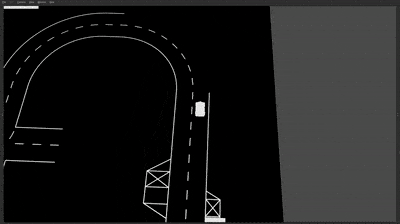

========================
kitcar-gazebo-simulation
========================

A ROS_ and Gazebo_ based simulation tool that can generate CaroloCup_ roads \
and simulate a car driving on the generated roads.

   View of the Gazebo user interface displaying the default_road.

ROS topics allow to easily access sensor data and modify the car's position or speed. Thus, allowing to completely simulate the behavior of the car.

.. figure:: docs/content/tutorials/resources/camera_default_road.gif
   :width: 400

   Front Camera Output of the Car.

Additionally, we provide a generative adversarial network that can be trained to modify the simulated camera image to look more realistic.

.. figure:: docs/content/tutorials/resources/gan_default_road.gif
   :width: 400

   Front Camera Output of the Car with the Neural Network turned on.

The documentation is available at https://public-doc.kitcar-team.de/kitcar-gazebo-simulation.

.. _CaroloCup: https://wiki.ifr.ing.tu-bs.de/carolocup/news
.. _Gazebo: http://gazebosim.org
.. _ROS: https://www.ros.org/

The repositories usage is licensed under a MIT license (''LICENSE'').
If external files are used, a specific LICENSE-file is provided in the same folder, covering the usage of those files.

.. readme_installation

Installation
============

The simulation has been developed and primarily used on Ubuntu 20.04.
Other Linux distributions were not tested.
Additionally, `ROS Installation <http://wiki.ros.org/ROS/Installation>`_ \
must be installed.

Clone
-----

The first step is of course to clone the repository.
These are some ways to get it:

* **KITcar internal**. Clone this repository in the same directory as `kitcar-ros`. ::

   git clone git@git.kitcar-team.de:kitcar/kitcar-gazebo-simulation.git $KITCAR_REPO_PATH/kitcar-gazebo-simulation

$KITCAR_REPO_PATH
-----------------

The environment variable **$KITCAR_REPO_PATH** must contain the directory in which you've cloned **kitcar-gazebo-simulation**.

Make sure that **$KITCAR_REPO_PATH** is set to the directory where you've cloned **kitcar-gazebo-simulation** into::

  cd $KITCAR_REPO_PATH/kitcar-gazebo-simulation

should put you into the root directory of **kitcar-gazebo-simulation**.

If it doesn't work, create the variable with::

   export KITCAR_REPO_PATH=<DIRECTORY WHERE kitcar-gazebo-simulation IS>

Adding

::

  export KITCAR_REPO_PATH=<DIRECTORY WHERE kitcar-gazebo-simulation IS>

to your ``.bashrc`` ensures that the path is always set.

Python
------

Ensure that your Python-Version is 3.8 or larger::

   python3 -V

If not, upgrade your system to Python 3.8.
(*KITcar internal: Goto* `KITcar-Gazebo-Simulation Python <https://wiki.kitcar-team.de/doku.php?id=teams:simulation:python>`_ )

ROS
---

ROS must also be installed on your machine.
If it's not yet installed, follow the `installation guide <http://wiki.ros.org/ROS/Installation>`_.

Init-Script
-----------

To install required packages run the init script. The packages are installed for the current user.
Change into `kitcar-gazebo-simulation` folder and run the script::

   cd $KITCAR_REPO_PATH/kitcar-gazebo-simulation
   ./init/init.sh

(*Ubuntu 18.04: Ignore any error thrown by pip when trying to install pygobject, it seems to be irrelevant.*)

If you want to, you can also install packages that are used to run machine learning tasks or compile the documentation.
But these packages are not needed to run all basic components of the simulation.

Build
-----

Then build `kitcar-gazebo-repository` by calling `catkin_make` in the simulation folder \
of this repository.

Data Version Control (DVC)
--------------------------

Datasets, machine learning models and similar are stored within a DVC container.
DVC is designed to bring version control to the world of machine learning and large datasets.
It integrates well with git.
If you have set up your credentials as described in `our WIKI <https://wiki.kitcar-team.de/doku.php?id=externe_tools:dvc>`_ ,
you can download all our datasets (very large, approx. 10 Gb) just execute::

   dvc pull

This is only necessary if you want to train or test our neural networks.

**If you are not part of KITcar, you cannot download our datasets.**
However, you can either setup your DVC server or simply use DVC locally.
See `DVC.org <https://dvc.org>`_ for more details.
Our pipelines used to train and test models or extract datasets from the simulation will
still work.

kitcar-rosbag
-------------

*This is only required by some scripts to record rosbags in the simulation.*

* **KITcar internal**. Clone `kitcar-rosbag` in the same directory as `kitcar-ros`. ::

   git clone git@git.kitcar-team.de:kitcar/kitcar-rosbag.git $KITCAR_REPO_PATH/kitcar-rosbag

  Then follow the installation steps there.

Test
----

Let's test if everything works. Open up a new terminal.

You can now start the simulation with

::

   roslaunch gazebo_simulation master.launch

Gazebo should now open with the car and a road.

Troubleshooting
---------------

* **Gazebo isn't shown correctly**

  This might be due to your graphics driver causing problems. Try to set ::

      export LIBGL_ALWAYS_SOFTWARE=1

  For further information take a look `here <http://wiki.ros.org/rviz/Troubleshooting>`_.
