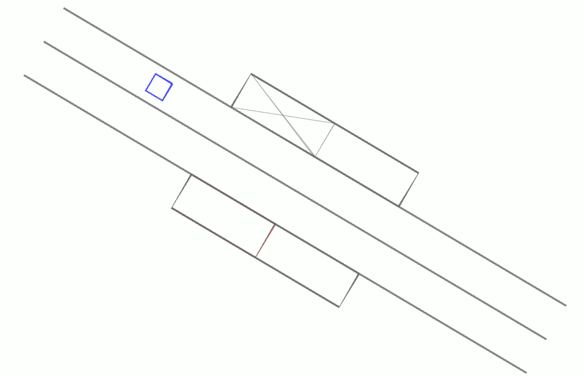

simulation_evaluation
=====================

The **evaluation** ROS package provides functionality to evaluate drives automatically.

.. program-output:: tree -a -L 3 -I __pycache__ --dirsfirst $KITCAR_REPO_PATH/kitcar-gazebo-simulation/simulation/src/simulation_evaluation | head -n -2 | tail -n +2
   :shell:

.. toctree::
   :maxdepth: 1
   :caption: Packages and Modules

   ../_source_files/simulation.src.simulation_evaluation.src.speaker
   ../_source_files/simulation.src.simulation_evaluation.src.state_machine
   ../_source_files/simulation.src.simulation_evaluation.src.referee
   ../_source_files/simulation.src.simulation_evaluation.src.evaluation_test

The simulation can be used to automatically detect errors in the car's driving behavior.
The simulation can even calculate a Carolo Cup score.
The goal is to evaluate the car's behavior in the same way a real referee would do.

.. note::

   Currently, the simulation cannot imitate manual interventions.
   If the car makes a mistake, the drive is considered a failure.

The evaluation pipeline consists of three main components:
The Speaker Node, the State Machine Node, and the
Referee Node; there's more about these nodes in the following.

.. graphviz::
   :align: center
   :caption: Schema of the Evaluation Pipeline

   digraph EvaluationPipeline {

     node [style=dotted, shape=box]; groundtruth_services; car_state_topic;
     node [style=solid, shape=ellipse]; speaker_node;
     node [shape=box]; speaker_topics; broadcast_topic;
     node [shape=ellipse]; state_machine_node;
     node [shape=box]; state_topics; set_topics;
     node [shape=ellipse]; referee_node;

     groundtruth_services -> speaker_node [style=dotted, dir=both];
     car_state_topic -> speaker_node [style=dotted];

     speaker_node -> speaker_topics;
     speaker_node -> broadcast_topic;

     speaker_topics -> state_machine_node;
     broadcast_topic -> referee_node;

     state_machine_node -> state_topics;
     set_topics -> state_machine_node;

     state_topics -> referee_node;
     referee_node -> set_topics;

     subgraph speaker_topics {
       rank="same"
       speaker_topics
       broadcast_topic
     }
     subgraph referee_topics {
       rank="same"
       state_topics
       set_topics
     }
   }
|

SpeakerNode
-----------

The :ref:`simulation.src.simulation_evaluation.src.speaker.node` subscribes to the car's \
state and accesses the groundtruth services. The SpeakerNode calls the groundtruth \
services for information about the simulated world.
E.g. get the position of obstacles or if the car has to stop at an intersection.
Additionally, the speaker node receives the car's frame, i. e. the car's dimensions, \
and it's twist, i.e. linear and angular speed, through the car slate topic.
Inside the node, there are multiple \
:ref:`simulation.src.simulation_evaluation.src.speaker.speakers` which use this \
information to complete different tasks:

* :py:class:`simulation.src.simulation_evaluation.src.speaker.speakers.zone.ZoneSpeaker`:
  Provide contextual information
  (e.g. the car is allowed to overtake, the car is inside a parking area)
* :py:class:`simulation.src.simulation_evaluation.src.speaker.speakers.area.AreaSpeaker`:
  Encode where the car currently is (e.g. on the right side of the road)
* :py:class:`simulation.src.simulation_evaluation.src.speaker.speakers.event.EventSpeaker`:
  Detect events such as collisions, parking attempts, ...
* :py:class:`simulation.src.simulation_evaluation.src.speaker.speakers.speed.SpeedSpeaker`:
  Convert the car's speed into discrete intervals (e.g. between 60 and 70)
* :py:class:`simulation.src.simulation_evaluation.src.speaker.speakers.broacast.BroadcastSpeaker`:
  Provide high-level information about the drive (e.g. distance the car has driven,\
  id and type of the section the car is currently driving in)

The speakers' results are used for two purposes.

- The Zone,-Area, Event,-and Speedspeaker create :ref:`Speaker <speaker_msg>` messages that the StateMachineNode's \
  state machines take as input.
- The BroadcastSpeaker creates a :ref:`Broadcast <broadcast_msg>` message that the RefereeNode uses \
  to calculate a score.

The Speaker message carries a *type* (and a *name* for debugging).

.. note::

   The SpeakerNode can be launched with:

   .. code-block::

      roslaunch simulation_evaluation speaker_node.launch

StateMachineNode
----------------

The :py:class:`simulation.src.simulation_evaluation.src.state_machine.node.StateMachineNode` contains multiple state machines that are used to automatically track the car's behavior over time.

The current state of each state machine is published as a :ref:`State <state_msg>` message on a separate topic.

State Machines
^^^^^^^^^^^^^^

There are four state machines which track the state of the drive.

OvertakingStateMachine
""""""""""""""""""""""

This state machine keeps track of overtaking obstacles.

See :mod:`simulation.src.simulation_evaluation.src.state_machine.state_machines.overtaking` for implementation details.

.. figure:: graphs/overtaking.svg
   :scale: 10 %
   :align: center
   :alt: Graph of OvertakingStateMachine

   Graph of OvertakingStateMachine

ParkingStateMachine
"""""""""""""""""""

This state machine keeps track of parking.

See :mod:`simulation.src.simulation_evaluation.src.state_machine.state_machines.parking` for implementation details.

.. figure:: graphs/parking.svg
   :scale: 5 %
   :align: center
   :alt: Graph of ParkingStateMachine

   Graph of ParkingStateMachine

PriorityStateMachine
""""""""""""""""""""

This state machine keeps track of the car correctly stoping or halting in front of stop or halt lines.

See :mod:`simulation.src.simulation_evaluation.src.state_machine.state_machines.priority` for implementation details.

.. figure:: graphs/priority.svg
   :scale: 5 %
   :align: center
   :alt: Graph of PriorityStateMachine

   Graph of PriorityStateMachine

ProgressStateMachine
""""""""""""""""""""

This state machines keeps track if the car has started, is driving or has finished the drive.

See :mod:`simulation.src.simulation_evaluation.src.state_machine.state_machines.progress` for implementation details.

.. figure:: graphs/progress.svg
   :scale: 10 %
   :align: center
   :alt: Graph of ProgressStateMachine

   Graph of ProgressStateMachine

.. note::

   The StateMachineNode can be launched with:

   .. code-block::

      roslaunch simulation_evaluation state_machine_node.launch

RefereeNode
-----------

The :mod:`simulation.src.simulation_evaluation.src.referee.node` is used to evaluate \
the output of the state machines and calculate a score.
The referee publishes a :ref:`Referee <referee_msg>` message containing a state, a score \
and more information about the current drive.

.. note::

   The RefereeNode can be launched with:

   .. code-block::

      roslaunch simulation_evaluation referee_node.launch

EvaluationTestNode
--------------------

The SpeakerNode's dependence on groundtruth services and the car state topic means \
that a complete road (for the groundtruth) and Gazebo (for the car's state) is necessary \
to test and debug the nodes in this package.

The :py:mod:`simulation.src.simulation_groundtruth.src.groundtruth.test.mock_node` \
can be used to create a groundtruth of simple predefined roads.
However, the car state is still missing: \
The :py:mod:`simulation.src.simulation_evaluation.src.evaluation_test.node` can be used \
to create CarState messages as if the car is driving on a predefined path \
with a predefined speed.

   RVIZ window with mocked groundtruth and blue car 'driving' on predefined path.

Available **roads**, **paths**, and **other parameters** are described in \
*simulation_groundtruth/param/mock_groundtruth/default.yaml*

.. note::

   The EvaluationTestNode can be launched with:

   .. code-block::

      roslaunch simulation_evaluation evaluation_test_node.launch

   By default this also launches RVIZ; appending *rviz:=false* prevents opening RVIZ.

The speakers base their interpretation on the groundtruth, \
queried from simulation.src.simulation_groundtruth.src.groundtruth topics, and the current position and \
speed of the car published by the \
:py:mod:`simulation.src.gazebo_simulation.src.car_state.node`.

