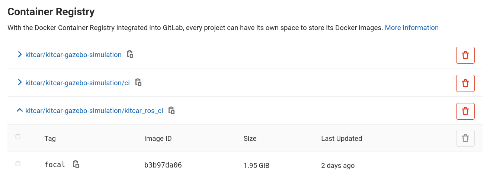
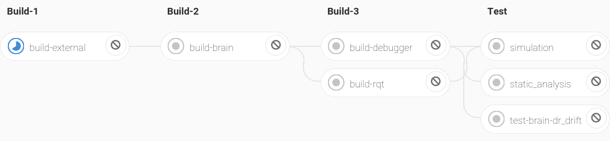
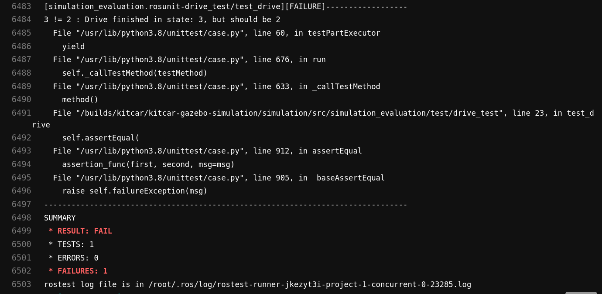

Put it into the CI!
======================

.. admonition:: We need

   #. A Docker image that contains the simulation,

      * is easily maintainable and
      * accessible from the CI!
   #. A new CI job in the kitcar-ros pipeline that runs the tests,

      * is integrable without many changes,
      * uses the simulation Docker image, and
   #. good test cases

      * with reproducible results
      * that are clear and precise!

Keep the Image updated
^^^^^^^^^^^^^^^^^^^^^^

.. literalinclude:: ../../../../.gitlab-ci.yml
   :language: yaml
   :start-after: CI docker image

Make it Accessible
^^^^^^^^^^^^^^^^^^

   Docker Images stored in the Gitlab Docker Registry

Easy Integration
^^^^^^^^^^^^^^^^

   Kitcar-ros Pipeline

.. code-block:: yaml

   simulation:
     stage: test
     image: git.kitcar-team.de:4567/kitcar/kitcar-gazebo-simulation/kitcar_ros_ci:focal
     variables:
       KITCAR_REPO_PATH: /builds/kitcar
       CAR_NAME: dr_drift
       DISPLAY: ":1.0"
     before_script:
       - ...
     script:
       - rostest simulation_evaluation drive.test road:=ci_roads/curves mission_mode:=1
       - rostest simulation_evaluation drive.test road:=ci_roads/obstacles mission_mode:=2
       - rostest simulation_evaluation drive.test road:=ci_roads/intersection mission_mode:=2
       - export INTERSECTION_TURN=1  # Left turn
       - rostest simulation_evaluation drive.test road:=ci_roads/intersection mission_mode:=2
       - export INTERSECTION_TURN=2  # Right turn
       - rostest simulation_evaluation drive.test road:=ci_roads/intersection mission_mode:=2

Results Should be Clear and Precise?
^^^^^^^^^^^^^^^^^^^^^^^^^^^^^^^^^^^^

**Well...**

   CI Output on Failure.

**A good solution on how to deliver the results is still missing!**

A good start would be to

  #. record rosbags and deliver them as CI artifacts, and
  #. clearly highlight the configuration of the simulation that errors can be reproduced locally.

*Other ideas are very much appreciated...*

Go back to :ref:`talk_ci_tests_outlook`.
