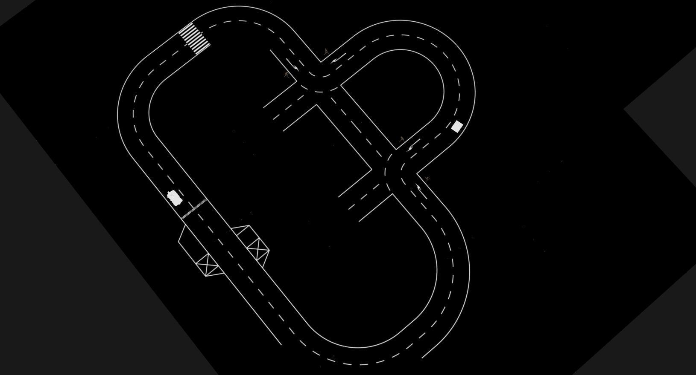
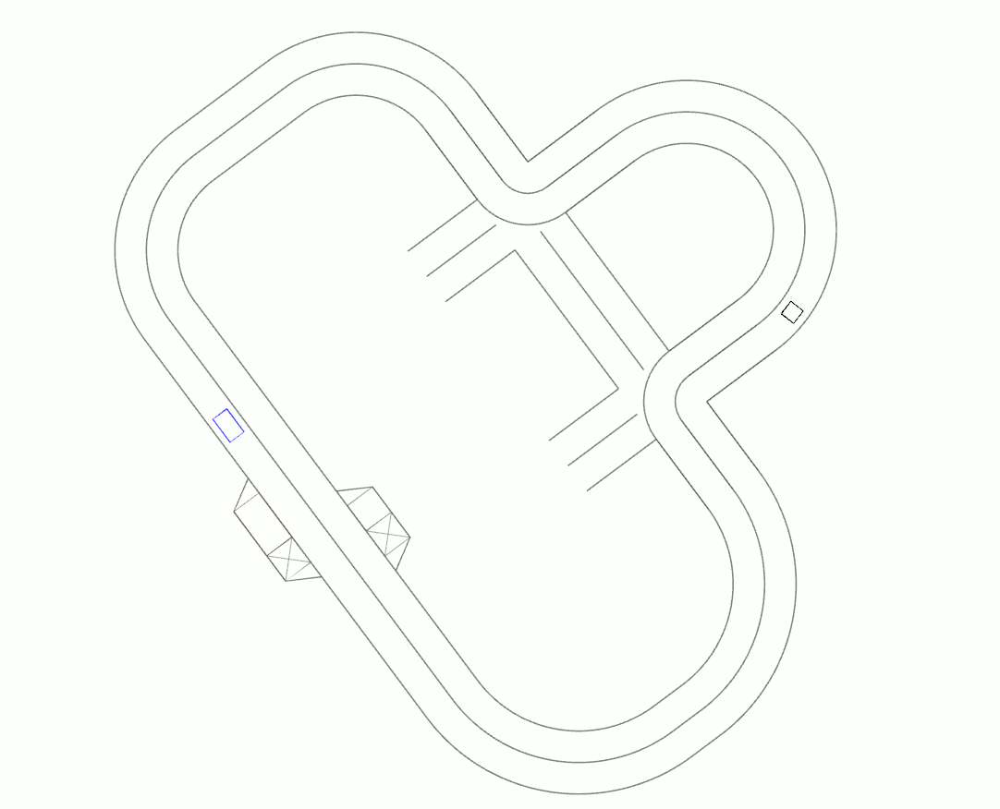
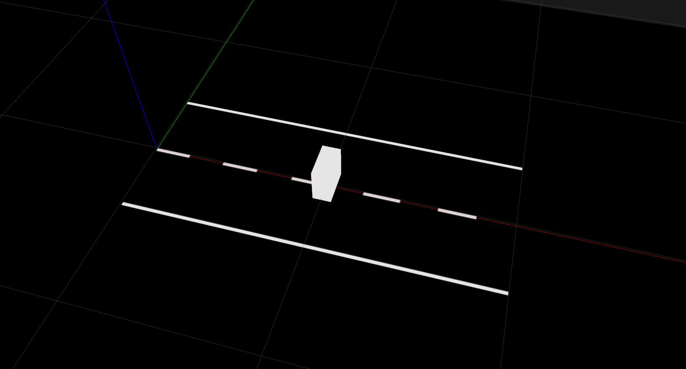

Groundtruth
===========

|pic1| |pic2|

The groundtruth as well as the rendering process are directly linked to your python road file.
After the rendering process has finished the groundtruth is directly extracted from the road section classes.

.. graphviz::

    digraph {
    compound=true;
    rankdir=LR;
    { rank = same; Renderer }
    node [];
    subgraph cluster_road_file {
        label="Road file";
        "Road sections";
    }
    node [];
    subgraph cluster_groundtruth {
        label=Groundtruth;
        Services;
    }
    node [ shape=square ];
    "Road sections" ->Renderer [label="1."];
    "Road sections" -> Services [lhead=cluster_groundtruth][label="2."];
    }

The :mod:`simulation.src.simulation_groundtruth.src.groundtruth.node` provides \
a number of ROS services through which the groundtruth can be accessed by other ROS nodes.
Given a specific request, the groundtruth responds with ROS messages. E.g. given a section id, return all obstacles.

.. include:: ../../simulation_groundtruth/index.rst
  :start-after: service response object.
  :end-before: Renderer

Example
-------

.. literalinclude:: ../../tutorials/road_examples/example.py
   :language: python
   :linenos:
   :start-after: # - Beginning sphinx straight_road_obs -
   :end-before: # - Ending sphinx straight_road_obs -

.. prompt:: bash

   rosservice call /simulation/groundtruth/section

.. code-block:: shell

   sections:
   -
     id: 0
     type: 0

.. prompt:: bash

   rosservice call /simulation/groundtruth/lane "id : 0"

.. code-block:: shell

   lane_msg:
     left_line:
       -
         x: 0.0
         y: 0.40000000596
         z: 0.0
       -
         x: 2.0
         y: 0.40000000596
         z: 0.0
     middle_line:
       -
         x: 0.0
         y: 0.0
         z: 0.0
       -
         x: 2.0
         y: 0.0
         z: 0.0
     right_line:
       -
         x: 0.0
         y: -0.40000000596
         z: 0.0
       -
         x: 2.0
         y: -0.40000000596
         z: 0.0

.. prompt:: bash

   rosservice call /simulation/groundtruth/obstacle "id : 0"

.. code-block:: shell

   polygons:
     -
       frame:
         points:
           -
             x: 0.949999988079
             y: 0.10000000149
             z: 0.0
           -
             x: 1.04999995232
             y: 0.10000000149
             z: 0.0
           -
             x: 1.04999995232
             y: -0.10000000149
             z: 0.0
           -
             x: 0.949999988079
             y: -0.10000000149
             z: 0.0
           -
             x: 0.949999988079
             y: 0.10000000149
             z: 0.0
       type: 0

Available services:
  * Section message for all sections (id and type of section)
  * Lane message for requested road section (left, middle and right line)
  * Intersection tuple for requested road section (turn direction, priority rule, all lines)
  * Parking message for the left and right side of the requested road section (borders, spots and spot type)
  * Labeled polygon msg for each obstacle in the requested road section

Not yet available:
  * Surface markings (start line, speed limits, zebra crossing, ...)
  * Traffic signs
