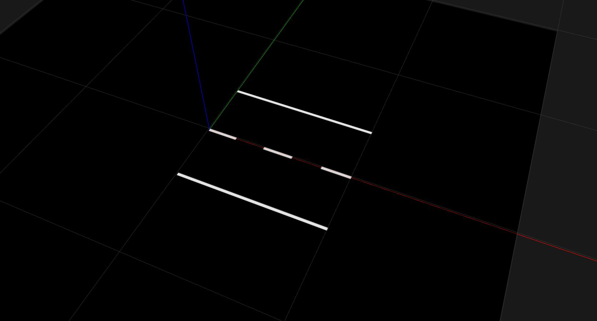

Roads and Road Sections
=======================

Roads
-----

**Roads are simple python scripts within** ``simulation/models/env_db``.

.. code-block:: python

   from simulation.utils.road.road import Road
   from simulation.utils.road.sections import *

   road = Road()

   road.append(StraightRoad())  # Replace with other road sections

Using python scripts has advantages:
  * No XML! 🎉 😃
  * Use standard loops and python math module
  * Create random roads with python random module
  * Use environment variables to quickly change the road without editing road files
  * pre-commit-hook formatting, autocomplete
  * future: integrate roads as graphs, form closed loops

Road Sections
-------------

To create more complex roads a sequence of modular sections is placed one after another.
This simple fact allows creating a large variety of roads using just a few different
:py:mod:`simulation.utils.road.sections`.

Example: ParkingArea
^^^^^^^^^^^^^^^^^^^^

This is an example of how to create a *ParkingArea* with two *ParkingSpots* on the left:

.. literalinclude:: ../../tutorials/road_examples/example.py
   :language: python
   :linenos:
   :start-after: # - Beginning sphinx parking_area -
   :end-before: # - Ending sphinx parking_area -

.. figure:: ../../tutorials/resources/example_parking_area.jpg

Others
^^^^^^

Also available:
  * Circular arcs, left and right
  * ZebraCrossing
  * Intersection (4-way, 3-way, turn straight, left, right, sloping
  * Bezier curves
  * Place traffic signs, obstacles and surface markings
  * StaticObstacle

Coming soon:
  * Blocked ParkingArea
  * TrafficIsland

Not yet available:
  * MovingObstacle
  * Ramp
  * Pedestrian

See :ref:`road_sections` for more details.
