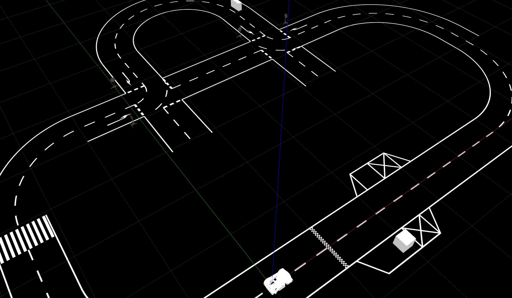
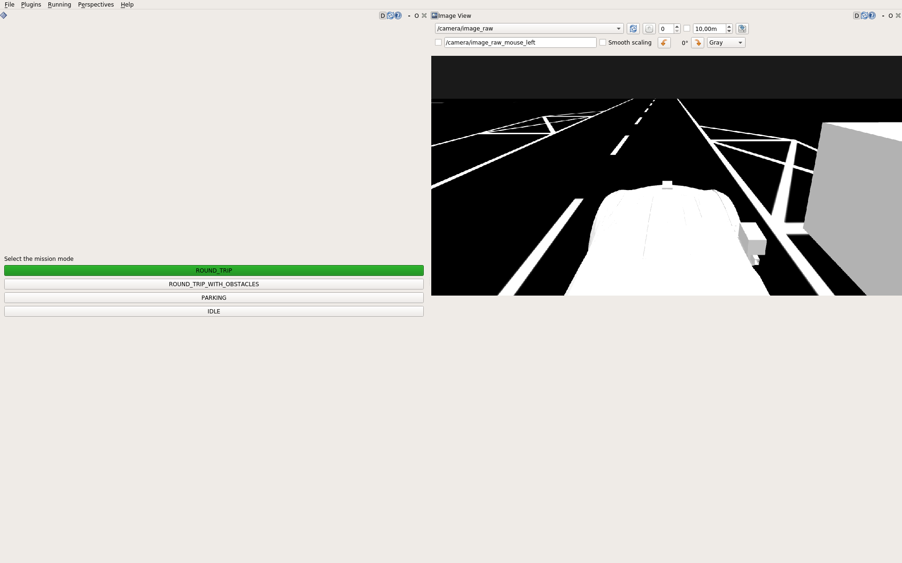

:orphan:

.. _getting_started:

Getting Started
=================

This page explains the first steps of using the simulation.
It only covers the very basics of what's happening behind the scenes.

Launch the Simulation
------------------------

The next step is to start the actual simulation:

.. admonition:: Launch the Simulation

   .. prompt:: bash

      roslaunch gazebo_simulation master.launch road:=<NAME_OF_ROAD>

Roads are defined as python scripts within ``simulation/models/env_db``.
The **default_road** can be started without the *road* argument:

.. prompt:: bash

   roslaunch gazebo_simulation master.launch

You should then see a road looking similar to the following:

See :ref:`master_launch` for more details.

With kitcar-ros
^^^^^^^^^^^^^^^

If **kitcar-ros** is installed, the **mission mode plugin** should open as well.
It can be used to choose a mission mode and tell the car to start driving.

   View of RQT with the mission mode plugin and image view.

Without kitcar-ros
------------------

.. warning::

   If kitcar-ros is not installed, errors can occur if nodes
   are attempted to launch that are not installed.
   Passing the launch arguments *include_brain:=false* and *include_vehicle_simulation:=false*
   excludes all nodes that are in kitcar-ros:

   .. prompt:: bash

      roslaunch gazebo_simulation master.launch include_brain:=false include_vehicle_simulation:=false

Without kitcar-ros, i.e. **KITcar_brain** and the **vehicle_simulation**,
the car can not start driving on its own.
However, the :ref:`automatic_drive_node` can move the car on the right side of the road;
effectively emulating the car's driving.

It can be started with:

.. prompt:: bash

   roslaunch gazebo_simulation master.launch include_automatic_drive:=true
