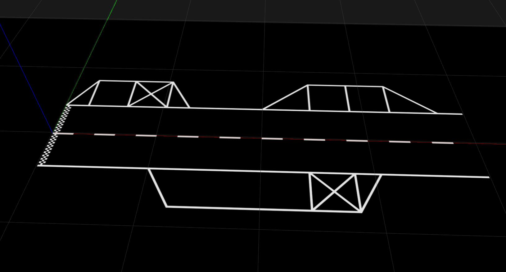
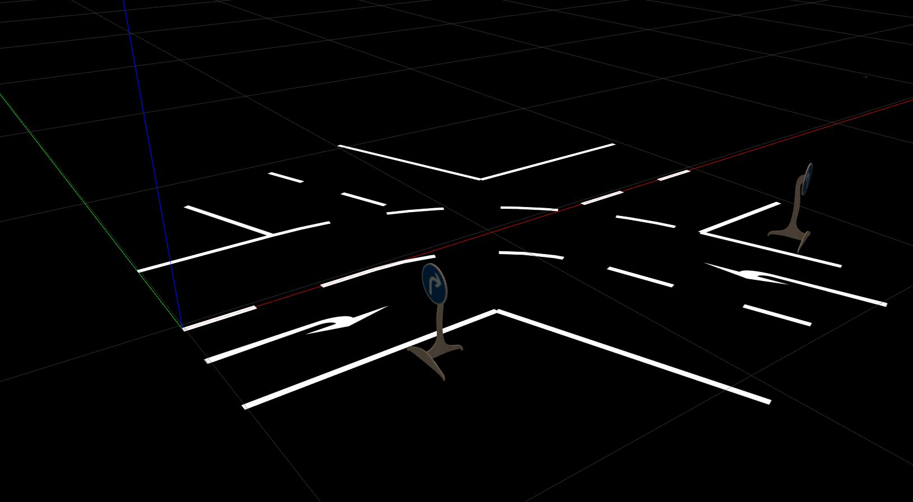
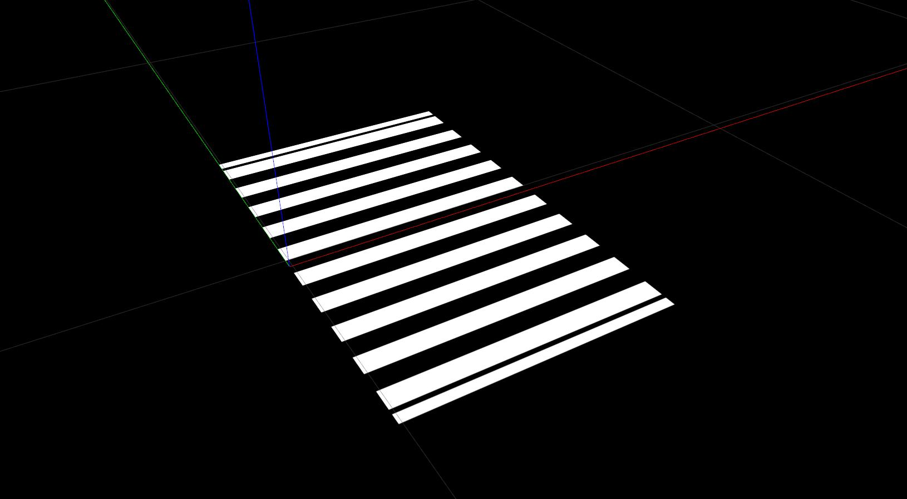
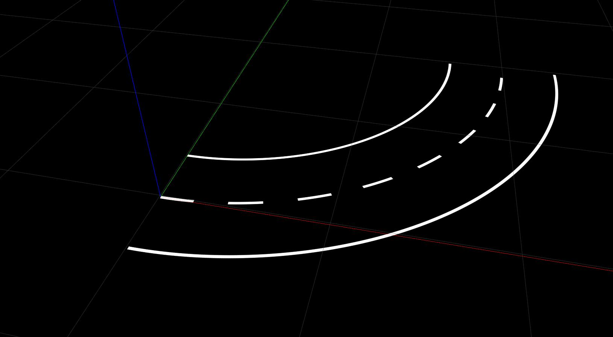

.. _road_sections:

Road Sections
=============

Roads are nothing more than a sequence of modular sections placed one after another.
This simple fact allows to create a large variety of roads using just a few different
:py:mod:`simulation.utils.road.sections`.

While :ref:`roads` provides a general introductions to roads,
this page aims to highlight the different available road sections.
Required and optional arguments are not explained in detail for every road section.
However, all arguments can always be found by checking out the implementation of each
section. (*Simply click on the link!*)

**Please note that all angles must be specified in radians!**

.. onboarding_start
StraightRoad
------------

The :py:class:`simulation.utils.road.sections.straight_road.StraightRoad` is a straight road.
This is an example on how to create a *StraightRoad*:

.. literalinclude::
   ../tutorials/road_examples/example.py
   :language: python
   :linenos:
   :start-after: # - Beginning sphinx straight_road -
   :end-before: # - Ending sphinx straight_road -

ParkingArea
----------------

The :py:class:`simulation.utils.road.sections.parking_area.ParkingArea` is a straight road
with parking lots on the left and right side.
The arguments :py:attr:`left_lots` and :py:attr:`right_lots` each define a list of
:py:class:`simulation.utils.road.sections.parking_area.ParkingLot`.
Each parking lot can contain multiple :py:class:`simulation.utils.road.sections.parking_area.ParkingSpot`\s.

This is an example on how to create a *ParkingArea*:

.. literalinclude::
   ../tutorials/road_examples/example.py
   :language: python
   :linenos:
   :start-after: # - Beginning sphinx parking_area -
   :end-before: # - Ending sphinx parking_area -

The *ParkingArea* takes three optional arguments, which are :py:attr:`start_line`, :py:attr:`left_lots`, and :py:attr:`right_lots`.
In the example, :py:attr:`start_line` is set to :py:func:`StartLine`. This creates a *StartLine* at the beginning of the *ParkingArea*.
If you do not want a StartLine, remove :py:attr:`start_line=StartLine()`. By default, :py:attr:`start_line` is :py:attr:`None`.
You can also discover this if you take a closer look at :py:class:`simulation.utils.road.sections.parking_area`.
If you want to take this one step further, it is also possible to create a ParkingArea without any children; practically a StraightRoad.

The arguments :py:attr:`left_lots` and :py:attr:`right_lots` expect a list of *ParkingLots*. In this example two lots are created on the left and one is on the right side.
In the first lot on the left side, two *ParkingSpots* are placed. As you already know, *ParkingSpots* can have three different types.
The first spot in this example is occupied by a *ParkingObstacle*, the second is blocked, i.e. it looks like an X.

The second lot on the left looks different. You can also specify a :py:attr:`length` and an :py:attr:`opening_angle` for a *ParkingLot*.
Here, the start is set to two meters from the beginning of the *ParkingArea*. If you do not specify the start argument (like in the first lot) it is set to zero.
The opening angle is set to 40 degrees; the default is 60 degrees.
For the first spot in this lot, no arguments are given and thus it's kind is ParkingSpot.FREE and there's no obstacle placed inside.
This is the default behavior for a *ParkingSpot*.

.. Caution::

    Be careful: it is possible to place an obstacle on a free spot.
    The rendered road will look perfectly fine but it can cause problems in automatic driving tests because on a free spot no obstacle is expected.

Moving to the single lot on the right side, you can see the third optional argument for a *ParkingLot*.
It is called :py:attr:`depth` and controls the depth (along the y-axis) of a lot.
There is no length parameter because the length (along the x-axis) is calculated as the sum of all spots in one lot.
To change the size of a spot along the x-axis, simply specify a :py:attr:`width` parameter.
You can not set the depth of a spot because it is derived from the parent lot.

Intersection
------------

.. literalinclude::
   ../tutorials/road_examples/example.py
   :language: python
   :linenos:
   :start-after: # - Beginning sphinx intersection -
   :end-before: # - Ending sphinx intersection -

In this example, the crossing roads intersect at a 110-degree angle.
The :py:attr:`turn` parameter indicates in which direction the road continues
after the intersection.
The possible turn values are :py:attr:`RIGHT`, :py:attr:`LEFT` and :py:attr:`STRAIGHT`,
the latter is the default.
The default size is 1.8 m and represents the length of each of the crossing roads.

ZebraCrossing
-------------

The zebra crossing spans the entire length of this section. If no length argument is given, it defaults to 0.45 m.

.. literalinclude::
   ../tutorials/road_examples/example.py
   :language: python
   :linenos:
   :start-after: # - Beginning sphinx zebra_crossing -
   :end-before: # - Ending sphinx zebra_crossing -

CircularArc
-----------

This section creates a circular arc pointing to the left (*LeftCircularArc*) and right (*RightCircularArc*).
This means instead of creating an arc with a negative radius to make it turn right the radius is always positive.
The two **required** parametes for an arc are :py:attr:`radius` and :py:attr:`angle`.

.. literalinclude::
   ../tutorials/road_examples/example.py
   :language: python
   :linenos:
   :start-after: # - Beginning sphinx left_arc -
   :end-before: # - Ending sphinx left_arc -

This example creates a circular arc to the left resulting in a 90-degree turn.

.. onboarding_end
